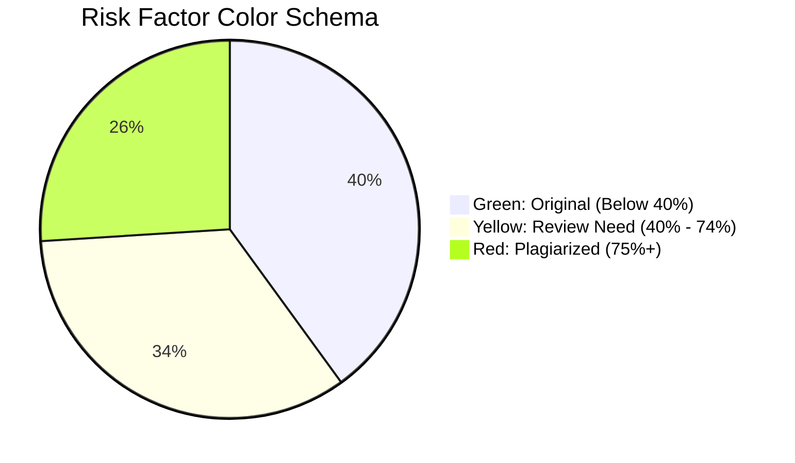

# Project Report: AI-Powered C++ Plagiarism Detector

This report provides a summary of the development and architectural updates made to the Plagiarism Detector application. The focus was on upgrading the detection mechanisms to handle structural similarities alongside textual matches, and modernizing the User Interface (UI) to look and feel like a professional AI Software-as-a-Service (SaaS) tool.

---

## 1. Project Overview & Motivation

The goal of this application is to analyze two C++ source code files and determine the likelihood of plagiarism between them.

Typically, basic plagiarism detectors only check if words match exactly. This is easily beaten by someone renaming variables or changing physical formatting. To fix this, our upgraded detector uses a dual-engine approach:
1. **N-Gram Text Analysis:** To catch identical patterns of phrasing and names.
2. **Abstract Syntax Tree (AST) Inspection:** To map out the *logic* of the code. If the logical flow of loops and statements matches, it flags it, even if the student replaced every named variable in their file.

## 2. Technical Architecture & Analysis Strategies

The C++ backend now scores similarity by blending these two distinct models:

### A. N-Gram Text Similarity (30% Weight)
N-Grams analyze sequences of text tokens to find overlaps in content (names, comments, syntax chunks).
- **Unigrams (Words):** Looks at single tokens (e.g., `int`, `x`, `=`, `5;`).
- **Bigrams (Phrases):** Looks at groups of two consecutive tokens (e.g., `int x`, `x =`).
- **Trigrams (Patterns):** Looks at groups of three (e.g., `int x =`).
These are evaluated via the **Cosine Similarity Algorithm**, establishing a mathematical "closeness" between the word frequencies of both files.

### B. AST Logical Flow Matching (70% Weight)
While n-grams find exact text copies, the AST model reads the program structurally.
- It steps through the code and builds a "skeleton" of the `for` loops, `if` conditions, assignments, and function calls.
- By comparing the "bones" of the code rather than its surface-level text, structurally copied code heavily raises the penalty score. 

```mermaid
graph TD
    A[File 1 (Source)] --> C(Cleaner / Tokenizer)
    B[File 2 (Target)] --> C
    
    C -->|Extracts Structure| D[AST Sequence Builder]
    C -->|Extracts Tokens| E[N-Gram Frequency Maps]
    
    D --> F{AST Comparator}
    E --> G{Cosine Similarity Calculator}
    
    F -->|70% Weight| H(((Final Score Engine)))
    G -->|30% Weight| H
    
    H --> I[HTML Report Generator]
```

---

## 3. UI/UX "SaaS Dashboard" Redesign

The application front-end (both the upload screen and the final report) underwent a tremendous aesthetic and functional upgrade designed for a premium user experience.

### Main Upload Page
* **Aesthetic Theme:** Deep navy blue to indigo gradient with glassmorphism backgrounds (blurry frosted glass style).
* **Interactivity:** A robust side-by-side drag-and-drop dashboard. Files validate locally with clear visual cues turning zones green upon successful load.
* **Tech Stack:** Powered seamlessly by `Flask` mapping the backend C++ executable.

### The Analysis Report
Our C++ engine parses the scores and dynamically injects data directly into a beautiful standalone `.html` report.



**Key Components Added to the Report:**
1. **Similarity Ring:** A large, central SVG ring filling dynamically to visualize the final percentage. 
2. **Breakdown Analytics:** Individual sliding bars represent the distinct similarity metrics for unigram, bigram, trigram, and AST overlap so the user exactly understands *why* the score was awarded.
3. **Plagiarism Insights:** An overarching visual "tag" board representing the shared identical variable names or strings isolated by the engine.
4. **Interactive Code-Split Screen Viewer:** Both uploaded raw `.cpp` scripts are parsed side-by-side inside scrollable code panes. Red highlights instantly illuminate exactly which rows were matched directly against the opposing file.

## 4. Conclusion

The application successfully bridges a remarkably powerful back-end inspection (combining lexical Cosine text-matching alongside AST structural tree traversal) with a beautifully dynamic front-end. It no longer just calculates numbers but presents them to the user via a modern split-pane SaaS interface that acts effortlessly professional.
